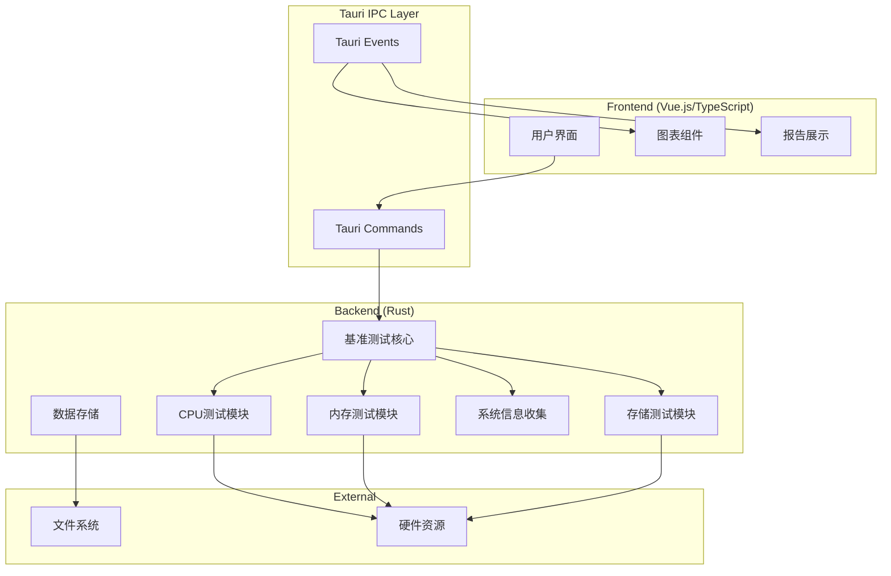

# Design Document

## Overview

Tauri基准测试套件是一个跨平台的桌面应用程序，专门为Windows工控机性能评估而设计。该应用采用Tauri框架，结合Rust后端的高性能计算能力和现代Web前端的用户体验，提供全面的硬件基准测试功能。

系统架构采用前后端分离的设计，前端使用Vue.js/TypeScript构建用户界面，后端使用Rust实现高性能的基准测试算法。通过Tauri的IPC机制实现前后端通信，确保测试过程的实时反馈和数据传输。

## Architecture



## Components and Interfaces

### Frontend Components

#### 1. MainApp Component
- **职责**: 应用程序主入口，管理全局状态和路由
- **接口**: 
  - `reactive` for global state management
  - `onMounted/onUnmounted` for lifecycle management
  - Tauri API调用接口

#### 2. BenchmarkSuite Component
- **职责**: 基准测试套件选择和配置界面
- **接口**:
  - `@test-select(testType: string)`: 测试选择事件
  - `@config-change(config: BenchmarkConfig)`: 配置变更事件

#### 3. TestRunner Component
- **职责**: 测试执行界面，显示实时进度和状态
- **接口**:
  - `startTest(testConfig: TestConfig)`: 启动测试方法
  - `@progress(progress: ProgressData)`: 进度更新事件
  - `@complete(results: TestResults)`: 测试完成事件

#### 4. ResultsViewer Component
- **职责**: 测试结果展示和可视化
- **接口**:
  - `displayResults(results: TestResults)`: 显示结果方法
  - `exportReport(format: 'pdf' | 'json')`: 导出报告方法

### Backend Modules

#### 1. BenchmarkCore
```rust
pub struct BenchmarkCore {
    config: BenchmarkConfig,
    results: Vec<TestResult>,
}

impl BenchmarkCore {
    pub fn new() -> Self;
    pub fn run_cpu_benchmark(&mut self) -> Result<CpuTestResult, BenchmarkError>;
    pub fn run_memory_benchmark(&mut self) -> Result<MemoryTestResult, BenchmarkError>;
    pub fn run_storage_benchmark(&mut self) -> Result<StorageTestResult, BenchmarkError>;
    pub fn get_system_info() -> SystemInfo;
}
```

#### 2. CPU测试模块
```rust
pub struct CpuBenchmark {
    thread_count: usize,
    test_duration: Duration,
}

impl CpuBenchmark {
    pub fn run_single_thread_test(&self) -> f64;
    pub fn run_multi_thread_test(&self) -> f64;
    pub fn run_floating_point_test(&self) -> f64;
    pub fn monitor_temperature(&self) -> Vec<f32>;
}
```

#### 3. 内存测试模块
```rust
pub struct MemoryBenchmark {
    buffer_size: usize,
    iteration_count: usize,
}

impl MemoryBenchmark {
    pub fn test_sequential_read(&self) -> f64;
    pub fn test_sequential_write(&self) -> f64;
    pub fn test_random_access(&self) -> f64;
    pub fn test_memory_latency(&self) -> f64;
}
```

#### 4. 存储测试模块
```rust
pub struct StorageBenchmark {
    file_size: u64,
    block_size: usize,
}

impl StorageBenchmark {
    pub fn test_sequential_read(&self) -> StorageMetrics;
    pub fn test_sequential_write(&self) -> StorageMetrics;
    pub fn test_random_read(&self) -> StorageMetrics;
    pub fn test_random_write(&self) -> StorageMetrics;
}
```

## Data Models

### 测试配置模型
```typescript
interface BenchmarkConfig {
  cpuTest: {
    enabled: boolean;
    duration: number; // seconds
    threadCount: number;
  };
  memoryTest: {
    enabled: boolean;
    bufferSize: number; // MB
    iterations: number;
  };
  storageTest: {
    enabled: boolean;
    fileSize: number; // MB
    blockSize: number; // KB
  };
}
```

### 测试结果模型
```typescript
interface TestResults {
  timestamp: string;
  systemInfo: SystemInfo;
  cpuResults?: CpuTestResult;
  memoryResults?: MemoryTestResult;
  storageResults?: StorageTestResult;
  overallScore: number;
}

interface CpuTestResult {
  singleThreadScore: number;
  multiThreadScore: number;
  floatingPointScore: number;
  averageTemperature: number;
  maxTemperature: number;
}

interface MemoryTestResult {
  sequentialReadSpeed: number; // MB/s
  sequentialWriteSpeed: number; // MB/s
  randomAccessSpeed: number; // MB/s
  latency: number; // nanoseconds
}

interface StorageTestResult {
  sequentialRead: StorageMetrics;
  sequentialWrite: StorageMetrics;
  randomRead: StorageMetrics;
  randomWrite: StorageMetrics;
}

interface StorageMetrics {
  throughput: number; // MB/s
  iops: number;
  latency: number; // milliseconds
}
```

### 系统信息模型
```typescript
interface SystemInfo {
  os: string;
  cpu: {
    name: string;
    cores: number;
    threads: number;
    baseFrequency: number;
    maxFrequency: number;
  };
  memory: {
    total: number; // GB
    available: number; // GB
    type: string;
    speed: number; // MHz
  };
  storage: Array<{
    name: string;
    type: 'SSD' | 'HDD' | 'NVMe';
    capacity: number; // GB
    interface: string;
  }>;
}
```

## Error Handling

### 错误类型定义
```rust
#[derive(Debug, thiserror::Error)]
pub enum BenchmarkError {
    #[error("系统信息获取失败: {0}")]
    SystemInfoError(String),
    
    #[error("CPU测试失败: {0}")]
    CpuTestError(String),
    
    #[error("内存测试失败: {0}")]
    MemoryTestError(String),
    
    #[error("存储测试失败: {0}")]
    StorageTestError(String),
    
    #[error("数据保存失败: {0}")]
    DataSaveError(String),
    
    #[error("权限不足: {0}")]
    PermissionError(String),
}
```

### 错误处理策略
1. **测试级别错误**: 单个测试失败不影响其他测试继续执行
2. **系统级别错误**: 记录错误日志，向用户显示友好的错误信息
3. **权限错误**: 提示用户以管理员权限运行应用程序
4. **硬件访问错误**: 提供降级测试选项，跳过无法访问的硬件组件

## Testing Strategy

### 单元测试
- **Rust后端**: 使用`cargo test`框架测试所有基准测试算法
- **TypeScript前端**: 使用Vitest和Vue Test Utils测试组件逻辑
- **覆盖率目标**: 核心业务逻辑达到90%以上的测试覆盖率

### 集成测试
- **Tauri IPC测试**: 验证前后端通信的正确性和性能
- **端到端测试**: 使用Tauri的测试框架模拟完整的用户操作流程
- **性能测试**: 验证基准测试本身的准确性和一致性

### 硬件兼容性测试
- **多种工控机配置**: 在不同CPU、内存、存储配置上验证测试准确性
- **Windows版本兼容性**: 支持Windows 10和Windows 11
- **权限测试**: 验证在不同用户权限下的功能可用性

### 自动化测试流程
- **GitHub Actions集成**: 每次代码提交自动运行测试套件
- **构建验证**: 确保在Windows环境下能够成功构建和运行
- **发布前测试**: 在发布新版本前进行完整的回归测试